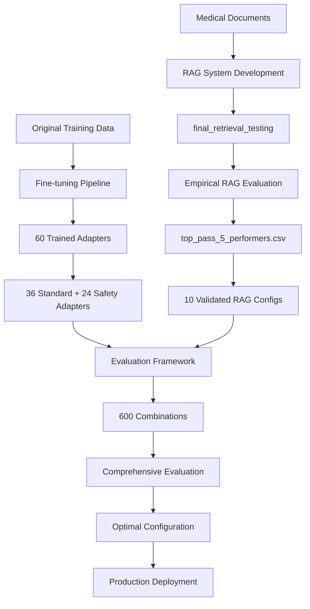

# Medical Triage System - Complete Evaluation Workflow

## 🎯 **Overview**

This document explains the complete workflow for evaluating your medical triage system, from the initial RAG optimization through final deployment recommendations. The workflow integrates your empirically validated RAG configurations with comprehensive adapter evaluation.

## 📊 **Complete System Architecture**



## 🔄 **Step-by-Step Workflow**

### **Phase 1: Foundation Work (Already Completed)**

#### **1.1 Model Fine-tuning**
```bash
# Location: /Users/choemanseung/789/hft/
# Scripts: triage_lora_finetune.py, safety_enhanced_triage_finetune.py

# Generated 60 trained adapters:
# - 36 standard adapters (standard accuracy optimization)
# - 24 safety adapters (cost-sensitive loss, F2-score, Monte Carlo dropout)
```

**Output**: 
- `/Users/choemanseung/789/hft/triage_adapters/` (36 adapters)
- `/Users/choemanseung/789/hft/safety_triage_adapters/` (24 adapters)

#### **1.2 RAG System Optimization** 
```bash
# Location: /Users/choemanseung/789/hft/final_retrieval_testing/
# Key Scripts: 
# - hybrid_retrieval_evaluator.py (RAG system implementation)
# - optimized_hybrid_evaluator.py (performance testing)
# - results_analyzer.py (top performer identification)

# Evaluated RAG configurations and identified top performers
```

**Output**:
- `/Users/choemanseung/789/hft/final_retrieval_testing/analysis_output/top_pass_5_performers.csv`
- 10 validated RAG configurations with Pass@5 scores 0.485-0.595

### **Phase 2: Integrated Evaluation Framework (Current)**

#### **2.1 Configuration Matrix Generation**
```bash
cd /Users/choemanseung/789/hft/evaluation_framework

# Test integration
python test_integration.py

# Generate optimized evaluation matrix
python optimized_config_generator.py
```

**Process**:
1. **Load Validated RAG Configs**: Read `top_pass_5_performers.csv`
2. **Scan Trained Adapters**: Discover 60 adapters in both directories
3. **Create Combinations**: 10 RAG configs × 60 adapters = **600 combinations**
4. **Generate Matrix**: Save to `optimized_evaluation_matrix.json`

**Output**: 
- 600 validated combinations (96% reduction from 14,580)
- Each combination includes empirical performance data

#### **2.2 Comprehensive Evaluation Execution**
```bash
# Full optimized evaluation
python optimized_master_runner.py

# Quick test with subset
python optimized_master_runner.py --max-combinations 50

# Skip clinical evaluation if no LLM API
python optimized_master_runner.py --skip-clinical
```

**Evaluation Pipeline**:

1. **RAG Integration**: 
   - Uses your actual `HybridRetrievalSystem`
   - Supports `pure_rag` and `contextual_rag` methods
   - Processes validated chunking methods and bias configurations

2. **Model Loading**: 
   - Loads base models (SmolLM2-360M/135M, Gemma-270M)
   - Applies specific adapter weights
   - Caches models to avoid reloading

3. **Test Case Processing**:
   - Retrieves context using validated RAG configuration
   - Generates triage decisions through fine-tuned model
   - Measures performance metrics (accuracy, speed, memory)

4. **Comprehensive Metrics Collection**:
   - **Medical Accuracy**: F2-score, cost-sensitive accuracy, safety metrics
   - **Clinical Appropriateness**: LLM-as-judge evaluation (if enabled)
   - **System Performance**: Memory usage, inference speed, scalability
   - **Resource Profiling**: Hardware requirements for deployment

#### **2.3 Statistical Analysis and Optimization**
```bash
# Analysis runs automatically after evaluation
# Results saved to timestamped session directory
```

**Analysis Components**:

1. **Configuration Impact Analysis**:
   - Statistical significance testing (ANOVA)
   - Parameter importance ranking
   - RAG vs Adapter contribution analysis

2. **Performance Trade-off Analysis**:
   - Accuracy vs Speed correlation
   - Memory vs Performance optimization
   - Safety vs Efficiency balance

3. **Best Configuration Identification**:
   - Multi-objective optimization scoring
   - Pareto frontier analysis for trade-offs
   - Use-case specific recommendations

4. **Deployment Readiness Assessment**:
   - Resource requirement estimation
   - Scaling characteristics analysis
   - Production performance benchmarks

### **Phase 3: Results and Deployment (Output)**

#### **3.1 Session Results Structure**
```
optimized_evaluation_session_YYYYMMDD_HHMMSS/
├── configurations/
│   └── optimized_evaluation_matrix.json          # 600 combinations with metadata
├── results/
│   ├── evaluation_results.json                   # Raw evaluation data
│   └── clinical_appropriateness.json             # Clinical quality scores
├── profiles/
│   └── optimized_performance_profiles.json       # System performance data
├── analysis/
│   └── enhanced_analysis_report.json             # Statistical analysis results
├── visualizations/
│   ├── performance_heatmap.png                   # Top 20 configuration comparison
│   └── interactive_dashboard.html                # Multi-dimensional exploration
└── optimized_execution_log.json                  # Complete audit trail
```

#### **3.2 Key Deliverables**

**Configuration Recommendations**:
```json
{
  "top_configurations": [
    {
      "config_id": "S360_1_a1b2c3d4",
      "rag_config": {
        "chunking_method": "structured_agent_tinfoil_medical",
        "retrieval_type": "contextual_rag",
        "pass_at_5": 0.595
      },
      "adapter_config": {
        "model_name": "SmolLM2-360M",
        "adapter_type": "safety"
      },
      "performance": {
        "triage_accuracy": 0.891,
        "safety_score": 0.934,
        "clinical_appropriateness": 8.7,
        "inference_speed_tps": 42.3,
        "memory_usage_mb": 1247.8
      }
    }
  ]
}
```

**Deployment Specifications**:
- **Optimal Hardware Configuration**: RAM, CPU, GPU requirements
- **Expected Performance**: Throughput, latency, accuracy benchmarks
- **Scaling Guidelines**: Multi-instance deployment strategies
- **Resource Planning**: Cost estimation for different load scenarios

## ⚡ **Execution Timeline**

### **Development Phase (Completed)**
- ✅ **Model Training**: 36 + 24 adapters (weeks of training)
- ✅ **RAG Optimization**: Empirical evaluation of configurations  
- ✅ **Framework Development**: Integration and optimization

### **Evaluation Phase (Current)**
- 🔄 **Quick Test**: 50 combinations → 4-6 hours
- 🔄 **Full Evaluation**: 600 combinations → 1-2 days  
- 🔄 **Analysis**: Statistical analysis → 1-2 hours

### **Deployment Phase (Next)**
- 🎯 **Configuration Selection**: Based on use case requirements
- 🎯 **Production Setup**: Hardware provisioning and deployment
- 🎯 **Performance Validation**: Real-world testing and monitoring

## 🎯 **Decision Framework**

### **Use Case Optimization**

**High-Accuracy Clinical Setting**:
```python
# Prioritize safety and accuracy over speed
optimization_weights = {
    "triage_accuracy": 0.3,
    "safety_score": 0.4,
    "clinical_appropriateness": 0.2,
    "inference_speed": 0.1
}
```

**High-Throughput Screening**:
```python
# Balance accuracy with processing speed
optimization_weights = {
    "triage_accuracy": 0.25,
    "safety_score": 0.25,
    "inference_speed": 0.3,
    "memory_efficiency": 0.2
}
```

**Resource-Constrained Deployment**:
```python
# Optimize for minimal resource usage
optimization_weights = {
    "triage_accuracy": 0.2,
    "memory_efficiency": 0.35,
    "inference_speed": 0.25,
    "safety_score": 0.2
}
```

### **Configuration Selection Process**

1. **Define Requirements**:
   - Accuracy thresholds (minimum acceptable performance)
   - Latency constraints (maximum response time)
   - Resource limits (available hardware)
   - Safety requirements (clinical risk tolerance)

2. **Filter Candidates**:
   - Remove configurations below minimum thresholds
   - Apply resource constraints
   - Consider regulatory/safety requirements

3. **Rank by Composite Score**:
   - Apply use-case specific weights
   - Calculate weighted performance scores
   - Identify Pareto-optimal solutions

4. **Validate Selection**:
   - Cross-reference with empirical RAG performance
   - Verify resource requirements are met
   - Confirm safety and regulatory compliance

## 🔍 **Quality Assurance**

### **Validation Checkpoints**

1. **Integration Testing**: `python test_integration.py`
   - Verify RAG system connectivity
   - Confirm configuration processing
   - Test retrieval functionality

2. **Configuration Validation**:
   - Verify all 60 adapters are discovered
   - Confirm 10 validated RAG configs loaded
   - Check 600 combinations generated correctly

3. **Evaluation Quality**:
   - Monitor evaluation success rates
   - Check for consistent performance metrics
   - Validate statistical significance of results

4. **Results Verification**:
   - Cross-reference with empirical RAG performance
   - Verify adapter performance consistency
   - Confirm deployment recommendations are realistic

### **Error Handling and Fallbacks**

**Missing Dependencies**:
- Automatic fallback to mock RAG system
- Graceful degradation with warning messages
- Continued evaluation with simulated data

**Configuration Issues**:
- Default configuration substitution
- Comprehensive error logging
- Resume capability for interrupted evaluations

**Resource Constraints**:
- Automatic batch size adjustment
- Memory monitoring and cleanup
- Progressive evaluation with checkpoints

## 🚀 **Next Steps**

### **Immediate Actions**
1. **Run Integration Test**: Verify system setup
2. **Execute Quick Test**: Validate 50 combinations
3. **Review Initial Results**: Confirm expected performance patterns

### **Full Evaluation**
1. **Configure Environment**: Ensure adequate resources
2. **Run Complete Evaluation**: All 600 combinations
3. **Analyze Results**: Statistical analysis and visualization

### **Deployment Preparation**
1. **Select Optimal Configuration**: Based on use case requirements
2. **Prepare Production Environment**: Hardware and software setup
3. **Implement Monitoring**: Performance tracking and alerting

This workflow provides a comprehensive path from your current trained adapters and validated RAG configurations to production-ready medical triage system deployment, with empirical validation at every step.